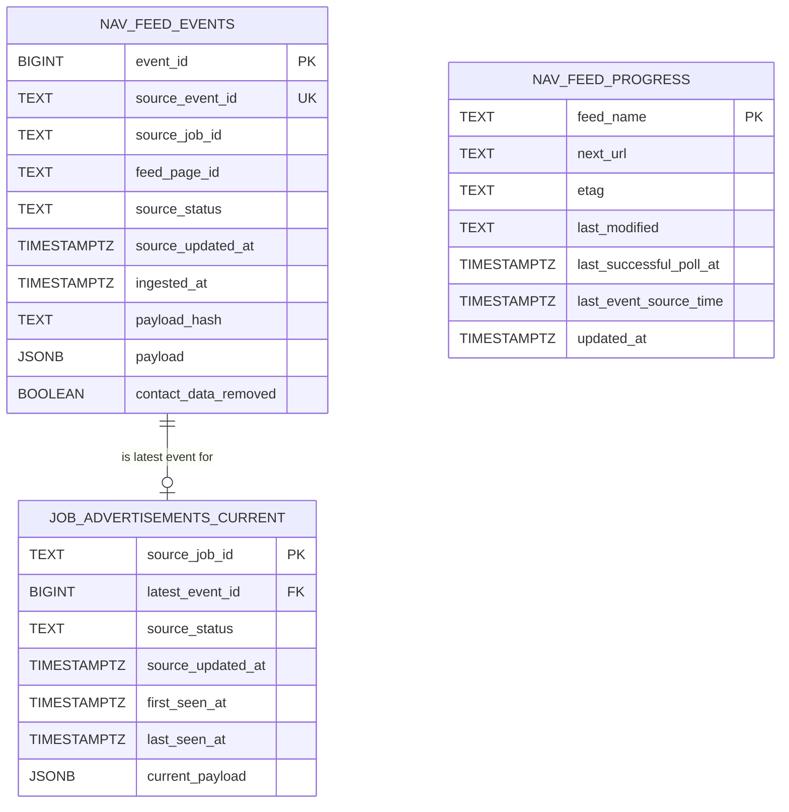

# Initial NAV Ingestion Data Model

## Purpose

This document defines the initial PostgreSQL storage model for ingesting job
advertisement events from the NAV `pam-stilling-feed`.

The model supports historical traceability, current-vacancy queries,
advertisement updates, inactive states, duplicate protection and safe recovery
after an interrupted ingestion run.

## Scope

This version covers only the ingestion and operational storage layer.

It defines:

- privacy-minimised NAV source-event storage
- the latest known state of each advertisement
- feed progress and conditional-request metadata
- initial keys, constraints, timestamps and operational indexes

It does not define analytical warehouse models, employer dimensions, location
dimensions, skill extraction, dbt models, API schemas or AI retrieval models.

## Storage responsibilities

### Privacy-minimised source events

`nav_feed_events` stores every accepted NAV feed event after `contactList` has
been removed. Rows are append-only and retain historical advertisement
versions for traceability, replay, debugging and reproducibility.

### Current advertisement state

`job_advertisements_current` stores one latest known record for each NAV
advertisement. A newer event may replace the current state without modifying or
deleting earlier event records.

### Feed progress

`nav_feed_progress` stores operational metadata required to resume polling
safely, including the next feed location and HTTP conditional-request values.
It contains ingestion state rather than vacancy data.

## Table descriptions

### `nav_feed_events`

Stores each accepted NAV feed event as an immutable historical record after
privacy minimisation.

A new event row is inserted whenever a new NAV feed item is accepted. Earlier
rows are never overwritten when an advertisement changes.

### `job_advertisements_current`

Stores one latest known state for each NAV advertisement.

The row may be replaced when a newer event is accepted, but its referenced
historical event remains immutable in `nav_feed_events`.

### `nav_feed_progress`

Stores one operational progress row per configured feed.

The row records where polling should continue and preserves the HTTP
conditional-request values needed to avoid downloading unchanged feed pages.

## Column descriptions

### `nav_feed_events`

| Column | Type | Purpose |
|---|---|---|
| `event_id` | `BIGINT GENERATED ALWAYS AS IDENTITY` | Internal PostgreSQL primary key |
| `source_event_id` | `TEXT NOT NULL` | NAV feed-item identifier used for provisional duplicate protection |
| `source_job_id` | `TEXT NOT NULL` | NAV advertisement identifier |
| `feed_page_id` | `TEXT` | Optional identifier of the feed page that supplied the event |
| `source_status` | `TEXT` | Source-provided advertisement state without an unverified enum constraint |
| `source_updated_at` | `TIMESTAMPTZ` | Source modification time when present |
| `ingested_at` | `TIMESTAMPTZ NOT NULL DEFAULT NOW()` | Time the event was stored |
| `payload_hash` | `TEXT NOT NULL` | Hash of the canonical privacy-minimised payload |
| `payload` | `JSONB NOT NULL` | Privacy-minimised source payload |
| `contact_data_removed` | `BOOLEAN NOT NULL DEFAULT TRUE` | Records that privacy minimisation occurred |

### `job_advertisements_current`

| Column | Type | Purpose |
|---|---|---|
| `source_job_id` | `TEXT PRIMARY KEY` | NAV advertisement identifier and current-state business key |
| `latest_event_id` | `BIGINT NOT NULL` | Historical event representing the latest accepted state |
| `source_status` | `TEXT NOT NULL` | Latest source-provided state without an unverified enum constraint |
| `source_updated_at` | `TIMESTAMPTZ` | Latest known source modification time |
| `first_seen_at` | `TIMESTAMPTZ NOT NULL` | Time the advertisement was first accepted by this platform |
| `last_seen_at` | `TIMESTAMPTZ NOT NULL` | Time the latest accepted state was observed |
| `current_payload` | `JSONB NOT NULL` | Latest privacy-minimised advertisement payload |

### `nav_feed_progress`

| Column | Type | Purpose |
|---|---|---|
| `feed_name` | `TEXT PRIMARY KEY` | Stable identifier for the configured feed |
| `next_url` | `TEXT` | URL or feed location to request next |
| `etag` | `TEXT` | Latest HTTP `ETag` value for conditional requests |
| `last_modified` | `TEXT` | Latest HTTP `Last-Modified` header value |
| `last_successful_poll_at` | `TIMESTAMPTZ` | Time the feed was most recently polled successfully |
| `last_event_source_time` | `TIMESTAMPTZ` | Latest processed source timestamp when available |
| `updated_at` | `TIMESTAMPTZ NOT NULL DEFAULT NOW()` | Time the progress row was last written |

`etag` and `last_modified` remain text because they are opaque HTTP header
values rather than application timestamps.

`updated_at` will be updated explicitly by ingestion logic. No automatic
database trigger is introduced in this initial model.

## Keys and constraints

### `nav_feed_events`

- `event_id` is the internal primary key.
- `source_event_id` has a provisional unique constraint because NAV feed-item
  identity is the strongest currently documented duplicate signal.
- `(event_id, source_job_id)` has a unique constraint so the current-state
  table can use a composite foreign key that verifies advertisement ownership.
- `contact_data_removed` must be `TRUE`.
- `payload` must be a JSON object.
- `payload` must not contain a top-level `contactList` key.

`payload_hash` is retained for integrity checking and diagnostics, but it is
not the initial uniqueness key. Different NAV events may legitimately contain
the same privacy-minimised payload.

Canonical JSON serialization and deterministic SHA-256 hashing are implemented
and covered by unit tests in the Python ingestion foundation. Database
persistence of the calculated hash will be introduced with the event-insertion
workflow.

### `job_advertisements_current`

- `source_job_id` is the primary key, allowing only one current row per
  advertisement.
- `(latest_event_id, source_job_id)` references
  `nav_feed_events (event_id, source_job_id)`.
- The foreign key uses restrictive deletion behaviour so a referenced
  historical event cannot be deleted accidentally.
- `last_seen_at` must be greater than or equal to `first_seen_at`.
- `current_payload` must be a JSON object.
- `current_payload` must not contain a top-level `contactList` key.

A separate uniqueness constraint on `latest_event_id` is unnecessary because
`source_job_id` already permits only one current row for each advertisement,
and the composite foreign key verifies that the referenced event belongs to
that advertisement.

### `nav_feed_progress`

- `feed_name` is the primary key.
- No constraint is added for `next_url`, `etag` or `last_modified` because
  their live formats have not yet been verified.
- No trigger is added for `updated_at`; ingestion code must update it
  explicitly.

No constraint is added for NAV status values until real feed responses confirm
the complete and stable set of accepted values.

## JSONB and typed-column policy

Typed columns are used for data required by operational logic:

- source and advertisement identifiers
- status filtering
- source and ingestion timestamps
- table relationships
- duplicate protection
- feed resumption and conditional requests

JSONB is used for `payload` and `current_payload` because:

- the live detailed-advertisement shape still requires verification
- source fields may change over time
- historical source traceability must be preserved
- analytical typing belongs in later transformation models
- premature extraction would create unstable ingestion columns

The initial ingestion schema does not create final analytical columns for
employers, locations, occupations, skills, language requirements or experience
levels.

No JSONB GIN index is added until observed query patterns justify one.

## Event immutability

Rows in `nav_feed_events` are append-only after insertion.

The ingestion application must not update historical event payloads, hashes,
source identifiers or timestamps. A changed advertisement creates another
event row rather than modifying an earlier row.

The initial migration does not introduce update-blocking triggers or dedicated
database roles. Immutability is enforced through the ingestion contract,
restrictive foreign keys and verification checks. Database-level write
permissions can be tightened after the runtime access model is defined.

## Current-state update model

Processing an accepted feed event should occur in one database transaction:

1. Privacy-minimise and validate the source payload.
2. Insert the immutable row into `nav_feed_events`.
3. Insert or update `job_advertisements_current`.
4. Preserve `first_seen_at` when updating an existing advertisement.
5. Set `latest_event_id`, `last_seen_at`, status and current payload from the
   newly accepted event.
6. Advance `nav_feed_progress` only after event and current-state processing
   succeeds.

If any step fails, the transaction should roll back so feed progress does not
move beyond data that was not stored successfully.

Duplicate `source_event_id` values should be handled idempotently by future
ingestion logic rather than creating another historical event.

## Inactive-advertisement handling

An advertisement remains stored when its latest accepted state is inactive.

The system must:

- retain all historical source events
- update the current-state row to the inactive source status
- keep the inactive advertisement available for permitted historical analysis
- exclude it from queries representing currently open vacancies
- preserve the relationship to its latest historical event
- continue enforcing the privacy boundary
- tolerate source fields that become missing, masked or removed

An inactive status does not trigger physical deletion.

The final retention period for inactive advertisements and historical events is
not defined in this model.

## Timestamp policy

All persisted timestamps use `TIMESTAMPTZ`.

The application should provide and interpret timestamps as UTC. Database
sessions used by ingestion and verification should also use UTC where
practical.

The timestamp fields have distinct meanings:

- `source_updated_at` records when NAV reports that the source advertisement
  changed. It may be absent and is not assumed to be globally unique.
- `ingested_at` records when this platform stored a historical event.
- `first_seen_at` records when this platform first accepted an advertisement.
- `last_seen_at` records when the latest accepted state was observed.
- `last_successful_poll_at` records when a feed request completed successfully.
- `last_event_source_time` records the latest processed source timestamp when
  that value is available.
- `updated_at` records when the feed-progress row was explicitly written.

Source timestamps must not be used as the only event identity or duplicate
key. Events with missing or equal source timestamps must still be processable.

The exact ordering relationship between feed-item identifiers, feed pages and
source timestamps remains an open question until real responses are inspected.

## Index strategy

The initial model adds only indexes justified by expected ingestion and
current-state queries.

### `nav_feed_events`

- An index on `source_job_id` supports retrieving the complete event history
  for one advertisement.
- An index on `source_updated_at` supports source-time ordering and incremental
  investigation when the timestamp is available.
- An index on `ingested_at` supports operational review, replay selection and
  investigation by platform ingestion time.

The primary key, unique `source_event_id` constraint and composite unique
constraint create their own supporting indexes.

### `job_advertisements_current`

- An index on `source_status` supports filtering current advertisements by
  active or inactive state.
- An index on `source_updated_at` supports ordering and filtering the latest
  records by source modification time.

No additional index is added for `latest_event_id` because current query
patterns do not yet justify it.

### `nav_feed_progress`

No secondary index is required because `feed_name` is the primary key and the
table is expected to contain only a small number of configured feeds.

No JSONB GIN index, partial status index or multi-column analytical index is
introduced before real query patterns are observed.

## Privacy boundary

Privacy minimisation occurs before any NAV payload is written to PostgreSQL.

The ingestion layer must:

1. Remove the source `contactList`.
2. Validate that the resulting payload is a JSON object.
3. Record `contact_data_removed = TRUE`.
4. Calculate the payload hash only after privacy minimisation.
5. Store only the privacy-minimised representation.

The database adds defensive constraints requiring:

- `contact_data_removed` to be `TRUE`
- `payload` and `current_payload` to be JSON objects
- no top-level `contactList` key in either stored payload

These constraints provide an additional safety barrier, but they do not replace
application-level sanitisation. The ingestion implementation remains
responsible for validating the complete source structure before persistence.

Personal contact information must not be copied into event columns,
current-state columns, logs, fixtures, analytical models, APIs or AI retrieval.

Synthetic verification data must contain no real names, email addresses or
telephone numbers.

## Example advertisement lifecycle

Consider a fictional NAV advertisement with source identifier
`synthetic-job-001`.

### Initial active event

1. NAV publishes feed event `synthetic-event-001`.
2. The ingestion layer removes `contactList`, validates the payload and
   calculates its hash.
3. A new immutable row is inserted into `nav_feed_events`.
4. A current-state row is created in `job_advertisements_current`.
5. `first_seen_at` and `last_seen_at` are set to the observation time.
6. `latest_event_id` references the first historical event.
7. Feed progress advances only after the transaction succeeds.

At this point:

- one historical event exists
- one current-state row exists
- the advertisement is represented as active

### Updated active event

1. NAV publishes `synthetic-event-002` for the same advertisement.
2. A second immutable event row is inserted.
3. The current-state row is updated to reference the second event.
4. `first_seen_at` remains unchanged.
5. `last_seen_at`, source status, source timestamp and current payload are
   updated.
6. The first event remains available in history.

At this point:

- two historical events exist
- one current-state row exists
- the current-state row references the second event

### Inactive event

1. NAV publishes `synthetic-event-003` with an inactive state.
2. A third immutable event row is inserted.
3. The current-state row is updated to reference the third event.
4. The advertisement remains stored but is no longer treated as an open
   vacancy.
5. All three historical events remain available for permitted analysis and
   traceability.

At this point:

- three historical events exist
- one inactive current-state row exists
- no personal contact information is persisted
- no historical event has been overwritten or deleted

## Entity relationship diagram

The current-state relationship is implemented as a composite foreign key:

    (latest_event_id, source_job_id)
        -> nav_feed_events (event_id, source_job_id)

This ensures that the referenced latest event belongs to the same source
advertisement.

`nav_feed_progress` is intentionally independent. It records polling state and
does not own or reference advertisement records.

## Known limitations

This initial model has the following limitations:

- Live NAV payloads have not yet been ingested, so field formats and optionality
  still require verification.
- Uniqueness of `source_event_id` is provisional until real feed behaviour is
  observed.
- The payload-hash algorithm and canonical JSON representation are not yet
  defined.
- Database privacy constraints detect only a top-level `contactList`; complete
  source-structure validation remains an application responsibility.
- Event immutability is not yet enforced through database roles or
  update-blocking triggers.
- Advertisement status values are stored as text without a verified enum or
  lookup table.
- Feed progress stores the latest resumable state but not complete polling-run,
  retry or error history.
- No retention or archival policy has been defined for inactive advertisements
  or historical events.
- The tables use the default `public` schema rather than a dedicated ingestion
  namespace.
- No analytical warehouse, dimensional model or production ingestion service
  is included in this version.

## Open questions

The following questions require evidence from real NAV feed responses and
ingestion experiments:

1. Is the feed-item identifier globally unique across all feed pages and over
   the full retention period?
2. What advertisement status values occur, and which values represent an open,
   inactive, stopped or deleted vacancy?
3. Can multiple events for one advertisement contain the same source
   modification timestamp?
4. How are feed pages ordered, and what is the correct recovery behaviour after
   an interrupted polling sequence?
5. Are `ETag` and `Last-Modified` consistently available, and how should HTTP
   `304 Not Modified` responses affect feed progress?
6. Can stopped advertisements lose or mask fields required by the current-state
   projection?
7. What canonical JSON serialisation and hash algorithm should be used for
   `payload_hash`?
8. Should ingestion tables later move from `public` into a dedicated database
   schema?
9. What database roles and permissions are needed to enforce event
   immutability?
10. What retention and archival policy should apply to historical events and
    inactive advertisements?

These questions must be answered before provisional assumptions are converted
into stricter database constraints or production ingestion behaviour.
